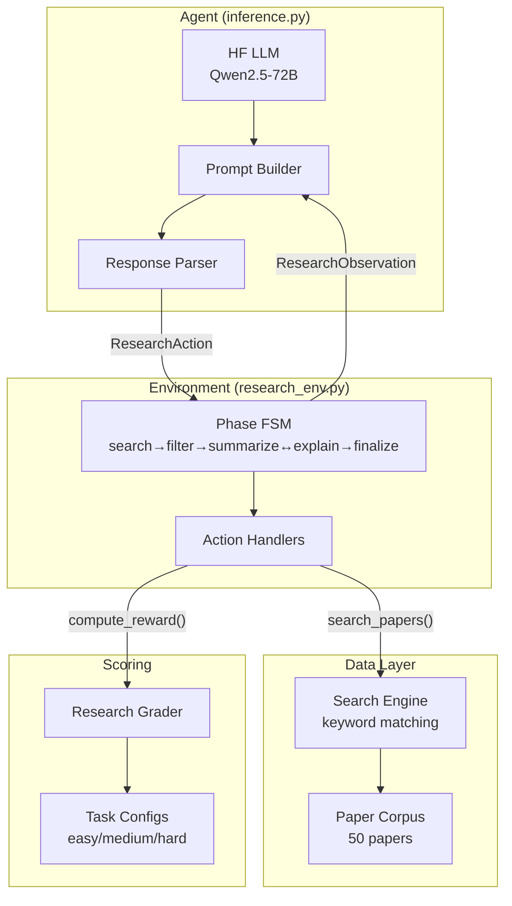

# 📚 Research Paper Assistant RL Environment — Detailed Explanation

## Table of Contents

1. [The Big Picture](#1-the-big-picture)
2. [Project Structure](#2-project-structure)
3. [File-by-File Breakdown](#3-file-by-file-breakdown)
4. [How the Pieces Fit Together](#4-how-the-pieces-fit-together)
5. [Complete Episode Walkthrough](#5-complete-episode-walkthrough)
6. [How to Run](#6-how-to-run)

---

## 1. The Big Picture

### What is this?

This is a **Reinforcement Learning (RL) environment** — not a model, not an agent, but the *world* an agent interacts with. Think of it like a game:

- The **environment** defines the rules, gives observations, and assigns rewards
- The **agent** (in `inference.py`) plays the game by choosing actions
- The **grader** scores how well the agent played

### What does the agent learn to do?

It simulates an **academic research assistant**. Given a natural language research question (e.g., *"What is the transformer architecture in NLP?"*), the agent must:

```
Step 1: SEARCH   → Find relevant papers from a corpus
Step 2: FILTER   → Pick the most relevant ones from results
Step 3: SUMMARIZE → Write technical summaries of key papers
Step 4: EXPLAIN   → Write user-friendly explanations
Step 5: FINALIZE  → Signal "I'm done" and get a final score
```

### Why RL?

The agent gets **dense rewards** at every step — not just a single score at the end. This reward signal teaches the agent:
- Good search keywords → positive reward
- Filtering correct papers → positive reward  
- Hallucinating fake paper IDs → negative penalty
- High-quality summaries → positive reward
- Repeating the same action → penalty (halved reward)

---

## 2. Project Structure

```
first_rl_env/
│
├── models.py                    ← Pydantic data shapes (Action/Observation)
├── client.py                    ← WebSocket client for remote interaction
├── inference.py                 ← The LLM agent that plays the game
├── __init__.py                  ← Package exports
│
├── data/                        ← The "world data" — fake research papers
│   ├── __init__.py
│   └── paper_corpus.py          ← 50 papers + search engine
│
├── tasks/                       ← Task definitions (easy/medium/hard)
│   ├── __init__.py              ← Task registry
│   ├── easy.py                  ← Single-topic retrieval
│   ├── medium.py                ← Ambiguous query filtering
│   └── hard.py                  ← Multi-concept synthesis
│
├── graders/                     ← Scoring engine
│   ├── __init__.py
│   └── grader.py                ← Deterministic 4-metric grader
│
├── server/                      ← Environment logic + HTTP server
│   ├── __init__.py
│   ├── research_env.py          ← THE CORE — environment state machine
│   └── app.py                   ← FastAPI HTTP wrapper
│
├── openenv.yaml                 ← Environment manifest for OpenEnv platform
├── pyproject.toml               ← Python project metadata + dependencies
├── Dockerfile                   ← Container definition
└── README.md                    ← User documentation
```

---

## 3. File-by-File Breakdown

### Layer 1: Data — The Paper Corpus

---

#### [data/__init__.py](file:///home/sayandip-saha/Desktop/CODING/RL_Environment_Design/Basics/first_rl_env/data/__init__.py)

Simple package initializer. Exports `PAPERS`, `get_paper_by_id`, `search_papers`.

---

#### [data/paper_corpus.py](file:///home/sayandip-saha/Desktop/CODING/RL_Environment_Design/Basics/first_rl_env/data/paper_corpus.py)

> [!IMPORTANT]
> This is the "world database" — the 50 fake research papers the agent can search through. No external APIs, no ArXiv calls, everything is self-contained.

**What it defines:**

1. **`CorpusPaper` dataclass** — The full representation of a paper:
   ```python
   @dataclass
   class CorpusPaper:
       id: str              # "paper_001"
       title: str           # "Attention Is All You Need..."
       abstract: str        # Full abstract text
       keywords: List[str]  # ["transformer", "attention", ...]
       year: int            # 2017
       sub_topic: str       # "transformer_architecture"
   ```

2. **`PAPERS` list** — 50 hand-crafted papers covering:
   - Transformers & attention (papers 001–005)
   - NLP language models (006–007)
   - Bayesian & uncertainty methods (008–012)
   - RL + LLMs (papers 013–020)
   - And ~30 more covering GNNs, diffusion, federated learning, etc.

3. **`_PAPER_INDEX` dict** — A lookup table `{paper_id → CorpusPaper}` for O(1) access.

4. **`get_paper_by_id(paper_id)`** — Returns a paper by its ID, or `None`.

5. **`search_papers(query, top_k=10)`** — The search engine:
   ```
   How it works:
   1. Tokenize the query into lowercase words
   2. For each paper, compute a relevance score:
      - +3 points per keyword match in paper's keywords list
      - +2 points per query word found in the title
      - +1 point per query word found in the abstract
   3. Sort by score descending
   4. Return top_k papers with score > 0
   ```

> [!TIP]
> The search is intentionally simple (keyword matching, not embeddings). This ensures **determinism** — same query always returns same results. It also means the agent must learn to pick good search keywords.

---

### Layer 2: Task Definitions

---

#### [tasks/__init__.py](file:///home/sayandip-saha/Desktop/CODING/RL_Environment_Design/Basics/first_rl_env/tasks/__init__.py)

The **task registry**. Contains:

1. **`TaskConfig` dataclass** — Defines what a task looks like:
   ```python
   @dataclass
   class TaskConfig:
       name: str                          # "single_topic_retrieval"
       difficulty: str                    # "easy"
       query: str                         # "What is the transformer...?"
       ground_truth_paper_ids: List[str]  # ["paper_001", "paper_002", "paper_005"]
       required_sub_topics: List[str]     # ["transformer_architecture"]
       min_summaries: int                 # 1
       min_explanations: int              # 1
       reference_keywords: Dict           # {paper_id: [keyword list]}
       explanation_keywords: Dict         # {paper_id: [keyword list]}
       grading_weights: Dict              # {"relevance": 0.3, ...}
       cross_reference_required: bool     # False for easy, True for hard
   ```

2. **`TASK_REGISTRY` dict** — Maps task names to their configs.

3. **`get_task(name)` / `list_tasks()`** — Accessors.

> [!NOTE]
> The `ground_truth_paper_ids` is the answer key. The grader compares the agent's filtered papers against this list.
> The `reference_keywords` define what a good summary should mention.
> The `explanation_keywords` define what a good explanation should cover.

---

#### [tasks/easy.py](file:///home/sayandip-saha/Desktop/CODING/RL_Environment_Design/Basics/first_rl_env/tasks/easy.py)

**Task: `single_topic_retrieval`**

| Field | Value |
|-------|-------|
| Query | "What is the transformer architecture in NLP?" |
| Ground truth papers | paper_001, paper_002, paper_005 |
| Required sub-topics | `transformer_architecture` only |
| Min summaries | 1 |
| Min explanations | 1 |
| Cross-reference needed? | No |

The grading weights emphasize **relevance** and **correctness** (0.30 each) — finding the right papers and summarizing them accurately matters most for easy tasks.

---

#### [tasks/medium.py](file:///home/sayandip-saha/Desktop/CODING/RL_Environment_Design/Basics/first_rl_env/tasks/medium.py)

**Task: `ambiguous_query_filtering`**

| Field | Value |
|-------|-------|
| Query | "How do neural networks handle uncertainty?" |
| Ground truth papers | 6 papers across 3 sub-topics |
| Required sub-topics | `bayesian_nn`, `dropout_uncertainty`, `ensemble_methods` |
| Min summaries | 3 |
| Min explanations | 2 |
| Cross-reference needed? | No |

The challenge is the **ambiguous query** — "uncertainty" could mean Bayesian priors, Monte Carlo dropout, or ensemble disagreement. The agent must cover all three sub-topics.

---

#### [tasks/hard.py](file:///home/sayandip-saha/Desktop/CODING/RL_Environment_Design/Basics/first_rl_env/tasks/hard.py)

**Task: `multi_concept_synthesis`**

| Field | Value |
|-------|-------|
| Query | "What are the recent advances combining RL with LLMs for decision-making?" |
| Ground truth papers | 10 papers across 4 sub-themes |
| Required sub-topics | `rlhf`, `tool_use_agents`, `rl_decision_making`, `planning_reasoning` |
| Min summaries | 5 |
| Min explanations | 3 |
| Cross-reference needed? | **Yes** — explanations must reference concepts from other papers |

The **explanation_quality** weight is highest (0.35) because synthesis is the hard part — connecting ideas across RLHF, tool use, RL decision-making, and planning.

---

### Layer 3: Models (Data Shapes)

---

#### [models.py](file:///home/sayandip-saha/Desktop/CODING/RL_Environment_Design/Basics/first_rl_env/models.py)

Defines the **language** the agent and environment speak to each other.

**`PaperInfo`** — What the agent sees about a paper:
```python
class PaperInfo(BaseModel):
    paper_id: str         # "paper_001"
    title: str            # "Attention Is All You Need..."
    abstract_snippet: str # First 200 chars of abstract
    keywords: List[str]   # ["transformer", "attention"]
```

**`ResearchAction`** — What the agent sends to the environment:
```python
class ResearchAction(Action):
    action_type: str      # "search" | "filter" | "summarize" | "explain" | "finalize"
    query_terms: str      # "transformer attention NLP" (for search)
    paper_ids: List[str]  # ["paper_001", "paper_003"] (for filter)
    paper_id: str         # "paper_001" (for summarize/explain)
    content: str          # "The transformer introduces..." (for summarize/explain)
```

**`ResearchObservation`** — What the environment returns to the agent:
```python
class ResearchObservation(Observation):
    query: str                       # The research question
    current_phase: str               # "search", "filter", etc.
    available_actions: List[str]     # What actions are valid now
    retrieved_papers: List[PaperInfo]# Search results
    filtered_papers: List[PaperInfo] # Agent's filtered selection
    summaries_so_far: Dict[str, str] # paper_id → summary text
    explanations_so_far: Dict        # paper_id → explanation text
    last_action_feedback: str        # "Found 12 papers. Proceed to filter..."
    step_count: int                  # Current step number
    max_steps: int                   # Maximum allowed (default 15)
    # Inherited from Observation base:
    done: bool                       # Is the episode over?
    reward: float                    # Reward for this step
    metadata: Dict                   # Extra info (task name, cumulative reward)
```

> [!NOTE]
> Both `Action` and `Observation` inherit from Pydantic's `BaseModel`, so they auto-validate types, serialize to JSON, and reject unknown fields (`extra="forbid"`).

---

### Layer 4: Grading Engine

---

#### [graders/grader.py](file:///home/sayandip-saha/Desktop/CODING/RL_Environment_Design/Basics/first_rl_env/graders/grader.py)

> [!IMPORTANT]
> This is the **referee** — it scores everything the agent does, both per-step (dense rewards) and at episode end (composite score).

**4 Metrics:**

| # | Metric | What it measures | How |
|---|--------|------------------|-----|
| 1 | **Relevance** | Did the agent find the right papers? | F1 score: `2 × precision × recall / (precision + recall)` comparing filtered IDs vs ground truth |
| 2 | **Correctness** | Are the summaries accurate? | For each summarized paper: `|agent_words ∩ reference_keywords| / |reference_keywords|` averaged across papers |
| 3 | **Completeness** | Did the agent cover all sub-topics? | `0.6 × topic_coverage + 0.2 × summary_count_ratio + 0.2 × explanation_count_ratio` |
| 4 | **Explanation Quality** | Are explanations good? | `0.3 × readability + 0.4 × accuracy + 0.3 × synthesis` |

**Per-step reward methods** (used during the episode):

```python
compute_search_reward()      → 0 to 0.10  (recall of GT papers in search results)
compute_filter_reward()      → 0 to 0.15  (F1 scaled)
compute_summary_reward()     → 0 to 0.20  (keyword overlap)
compute_explanation_reward() → 0 to 0.20  (readability + accuracy)
```

**Readability heuristic:**
- Average sentence length ≤ 25 words → score 1.0
- 25–40 words → linear decay
- > 40 words → 0.2 (run-on sentences)

**Synthesis check** (hard task only):
- Do explanations for paper A mention concepts from paper B's sub-topic?
- Cross-references between sub-themes → higher synthesis score

**Tokenization:** Uses regex `[a-z0-9]+` — no NLTK dependency, fully deterministic.

---

### Layer 5: The Core Environment

---

#### [server/research_env.py](file:///home/sayandip-saha/Desktop/CODING/RL_Environment_Design/Basics/first_rl_env/server/research_env.py)

> [!IMPORTANT]
> This is the **heart of the entire project** — the Finite State Machine (FSM) that implements the RL environment.

**Phase Transitions (FSM Rules):**

```python
PHASE_TRANSITIONS = {
    "search":    ["search", "filter"],         # Can re-search or proceed to filter
    "filter":    ["filter", "summarize"],       # Can re-filter or proceed to summarize
    "summarize": ["summarize", "explain", "finalize"],  # Can keep summarizing, explain, or end
    "explain":   ["explain", "summarize", "finalize"],  # Can keep explaining, go back, or end
    "finalize":  [],                           # Terminal — no more actions
}
```

**`__init__()`** — Sets up:
- State object with episode_id and step_count
- Task config (from `RESEARCH_TASK` env var)
- Grader instance
- Empty episode state (no papers, no summaries yet)

**`reset()`** — Starts a fresh episode:
1. Creates new episode_id
2. Re-reads task config (so you can change tasks between episodes via env var)
3. Clears all episode state
4. Returns initial observation with the query and `phase=search`

**`step(action)`** — The main loop. For each step:

```
1. Increment step counter
2. Log the action to history
3. VALIDATE: Is this action_type allowed in the current phase?
   → No? Return reward=-0.1 with error feedback
4. EXECUTE the action via handler method:
   - _handle_search(action)
   - _handle_filter(action)
   - _handle_summarize(action)
   - _handle_explain(action)
   - _handle_finalize()
5. CHECK for repeated identical action → halve the reward
6. CHECK step limit (default 15) → force-end with partial score
7. Return observation with reward, feedback, done status
```

**Handler methods:**

| Handler | What it does | Phase transition |
|---------|-------------|-----------------|
| `_handle_search` | Calls `search_papers(query_terms)`, stores results, computes search reward | search → filter |
| `_handle_filter` | Validates paper IDs, detects hallucinated IDs (penalty), computes F1 reward | filter → summarize |
| `_handle_summarize` | Validates paper exists, stores summary text, computes keyword reward | stays in summarize |
| `_handle_explain` | Validates paper exists, stores explanation, computes quality reward | stays in explain |
| `_handle_finalize` | Calls full `grader.grade()` to compute composite score | terminal (done=True) |

**Penalty System:**

| Violation | Penalty |
|-----------|---------|
| Wrong action for current phase | -0.10 |
| Empty search query | -0.05 |
| Empty summary/explanation content | -0.10 |
| Non-existent paper ID | -0.15 |
| Hallucinated paper ID in filter | -0.15 per ID |
| Paper not retrieved before summarize | -0.10 |
| Identical repeated action | reward × 0.5 |
| Exceeding step limit | partial score × 0.5 |

---

### Layer 6: Server & Client

---

#### [server/app.py](file:///home/sayandip-saha/Desktop/CODING/RL_Environment_Design/Basics/first_rl_env/server/app.py)

Wraps the environment in a **FastAPI HTTP/WebSocket server** using OpenEnv's `create_app`:

```python
app = create_app(
    ResearchAssistantEnvironment,   # Environment class
    ResearchAction,                 # Action model
    ResearchObservation,            # Observation model
    env_name="research_assistant_env",
    max_concurrent_envs=1,
)
```

This automatically creates these endpoints:

| Method | Path | Purpose |
|--------|------|---------|
| POST | `/reset` | Reset environment, get initial observation |
| POST | `/step` | Send action, get observation + reward |
| GET | `/state` | Get current episode state |
| GET | `/health` | Health check |
| GET | `/schema` | Action/observation JSON schemas |
| GET | `/metadata` | Environment metadata |
| WS | `/ws` | WebSocket for persistent sessions |
| POST | `/mcp` | Model Context Protocol endpoint |

---

#### [client.py](file:///home/sayandip-saha/Desktop/CODING/RL_Environment_Design/Basics/first_rl_env/client.py)

A **WebSocket client** for connecting to a remote environment server:

```python
with ResearchAssistantEnv(base_url="http://localhost:8000") as client:
    result = client.reset()
    result = client.step(ResearchAction(action_type="search", query_terms="transformer"))
```

Key methods:
- `_step_payload()` — Serializes `ResearchAction` → JSON dict
- `_parse_result()` — Deserializes JSON → `StepResult[ResearchObservation]`
- `_parse_state()` — Deserializes JSON → `State`

---

### Layer 7: The Agent (Inference)

---

#### [inference.py](file:///home/sayandip-saha/Desktop/CODING/RL_Environment_Design/Basics/first_rl_env/inference.py)

> [!IMPORTANT]
> This is the **agent that plays the game**. It uses a Hugging Face LLM to decide what action to take at each step.

**Entry point: `main()`**

```python
def main():
    # 1. Create LLM client (HF Inference API)
    client = InferenceClient(model=MODEL_NAME, token=API_KEY)
    
    # 2. Create environment locally (no HTTP server needed)
    env = ResearchAssistantEnvironment()
    
    # 3. Reset environment
    observation = env.reset()
    
    # 4. Game loop (up to MAX_STEPS=15)
    for step in range(1, MAX_STEPS + 1):
        if observation.done:
            break
        
        # Ask LLM what to do
        action_dict = get_model_action(client, observation, step, history)
        action = make_action(action_dict)
        
        # Execute action
        observation = env.step(action)
        
        # Log in mandatory format
        log_step(step, action_str, reward, done, error)
    
    # 5. Log final result
    log_end(success, steps, score, rewards)
```

**How the LLM decides actions:**

1. **System prompt** — Tells the LLM it's a research assistant agent, explains the phases, and shows JSON schemas for each action type.

2. **User prompt** (`build_user_prompt()`) — Built from the current observation:
   ```
   Step: 2/15
   Query: What is the transformer architecture in NLP?
   Current phase: filter
   Available actions: ['filter', 'summarize']
   Retrieved papers (12):
     - paper_001: Attention Is All You Need... [keywords: transformer, attention]
     - paper_005: Efficient Transformers... [keywords: transformer, efficiency]
   
   Respond with the appropriate JSON action.
   ```

3. **Response parsing** (`parse_model_response()`) — Handles common LLM output issues:
   - Strips markdown code fences
   - Tries direct JSON parse
   - Falls back to regex extraction of `{...}`
   - Last resort: returns `{"action_type": "finalize"}` to end gracefully

**STDOUT format** (mandatory for OpenEnv):
```
[START] task=single_topic_retrieval env=research_assistant_env model=Qwen/Qwen2.5-72B-Instruct
[STEP] step=1 action=search:transformer+attention+NLP reward=0.08 done=false error=null
[STEP] step=2 action=filter:paper_001,paper_003 reward=0.15 done=false error=null
[END] success=true steps=5 score=0.820 rewards=0.08,0.15,0.16,0.18,0.82
```

---

### Layer 8: Configuration Files

---

#### [openenv.yaml](file:///home/sayandip-saha/Desktop/CODING/RL_Environment_Design/Basics/first_rl_env/openenv.yaml)

The **manifest file** that tells the OpenEnv platform about this environment:
- Name, description, runtime type (FastAPI)
- Port (8000)
- 3 task definitions with difficulty levels
- Action and observation JSON schemas

#### [pyproject.toml](file:///home/sayandip-saha/Desktop/CODING/RL_Environment_Design/Basics/first_rl_env/pyproject.toml)

Python project metadata:
- Dependencies: `huggingface-hub`, `openenv-core[core]`, `pydantic`
- Package mapping so Python can find all sub-packages

#### [Dockerfile](file:///home/sayandip-saha/Desktop/CODING/RL_Environment_Design/Basics/first_rl_env/Dockerfile)

Multi-stage Docker build:
1. **Builder stage**: Installs dependencies with `uv sync`
2. **Runtime stage**: Copies venv + code, runs `uvicorn server.app:app`
3. Sets `RESEARCH_TASK` and `RESEARCH_MAX_STEPS` as configurable env vars

---

## 4. How the Pieces Fit Together



**Data Flow for ONE step:**

```
1. Agent reads observation (query, phase, papers, feedback)
2. Prompt builder creates context-rich prompt from observation
3. LLM generates JSON action
4. Parser extracts action dict, converts to ResearchAction
5. Environment validates action against FSM rules
6. Handler executes action (search corpus / store summary / etc.)
7. Grader computes step reward
8. Environment builds new observation with updated state
9. Observation returned to agent → repeat from step 1
```

---

## 5. Complete Episode Walkthrough

Here's what happens for the **easy task** when everything goes right:

```
┌─────────────────────────────────────────────────────────┐
│ RESET                                                    │
│ Task: single_topic_retrieval                             │
│ Query: "What is the transformer architecture in NLP?"    │
│ Phase: search                                            │
│ Available: [search]                                      │
└─────────────────────────────────────────────────────────┘
          │
          ▼
┌─────────────────────────────────────────────────────────┐
│ STEP 1: search                                           │
│ Agent sends: {action_type: "search",                     │
│               query_terms: "transformer attention NLP"}  │
│                                                          │
│ Environment:                                             │
│   1. search_papers("transformer attention NLP", top_k=15)│
│   2. Returns 12 matching papers                          │
│   3. Checks: 3/3 ground truth papers in results → 100%  │
│   4. Reward: 0.1 × (3/3) = 0.100                        │
│   5. Transitions: search → filter                        │
│                                                          │
│ Observation: 12 papers listed, phase=filter              │
└─────────────────────────────────────────────────────────┘
          │
          ▼
┌─────────────────────────────────────────────────────────┐
│ STEP 2: filter                                           │
│ Agent sends: {action_type: "filter",                     │
│               paper_ids: ["paper_001","paper_002",       │
│                            "paper_005"]}                 │
│                                                          │
│ Environment:                                             │
│   1. Validates all 3 IDs exist in retrieved set ✓        │
│   2. F1 = 2×1.0×1.0/(1.0+1.0) = 1.0 (perfect match)   │
│   3. Reward: 0.15 × 1.0 = 0.150                         │
│   4. Transitions: filter → summarize                     │
└─────────────────────────────────────────────────────────┘
          │
          ▼
┌─────────────────────────────────────────────────────────┐
│ STEP 3: summarize                                        │
│ Agent sends: {action_type: "summarize",                  │
│               paper_id: "paper_001",                     │
│               content: "The Transformer introduces       │
│                multi-head self-attention mechanism..."}   │
│                                                          │
│ Environment:                                             │
│   1. Paper exists ✓, in filtered set ✓                   │
│   2. Reference keywords for paper_001:                   │
│      ["self-attention", "encoder-decoder", "positional   │
│       encoding", "multi-head", "parallelization"]        │
│   3. Agent text hits: self-attention ✓, multi-head ✓,    │
│      positional encoding ✓ = 3/5 = 0.60                 │
│   4. Reward: 0.2 × 0.60 = 0.120                         │
│   5. Stays in summarize phase                            │
└─────────────────────────────────────────────────────────┘
          │
          ▼
┌─────────────────────────────────────────────────────────┐
│ STEP 4: explain                                          │
│ Agent sends: {action_type: "explain",                    │
│               paper_id: "paper_001",                     │
│               content: "Instead of reading words one     │
│                by one, the Transformer looks at all      │
│                words simultaneously using attention..."}  │
│                                                          │
│ Environment:                                             │
│   1. Readability: avg sentence ~18 words → 1.0           │
│   2. Explanation keywords hit: 4/6 = 0.67                │
│   3. Reward: 0.2 × (0.5×1.0 + 0.5×0.67) = 0.167        │
│   4. Transitions to explain phase                        │
└─────────────────────────────────────────────────────────┘
          │
          ▼
┌─────────────────────────────────────────────────────────┐
│ STEP 5: finalize                                         │
│ Agent sends: {action_type: "finalize"}                   │
│                                                          │
│ Grader computes composite score:                         │
│   relevance    = 1.000 × 0.30 = 0.300                   │
│   correctness  = 0.600 × 0.30 = 0.180                   │
│   completeness = 0.867 × 0.20 = 0.173                   │
│   expl_quality = 0.650 × 0.20 = 0.130                   │
│                                                          │
│   FINAL SCORE = 0.784                                    │
│   done = True                                            │
└─────────────────────────────────────────────────────────┘
```

---

## 6. How to Run

### Prerequisites

```bash
# Python 3.10+
python --version

# You should already have the venv created by uv
ls .venv/bin/python
```

### Option A: Run Local Smoke Test (No API Key Needed)

This tests the environment logic directly without any LLM:

```bash
cd /home/sayandip-saha/Desktop/CODING/RL_Environment_Design/Basics/first_rl_env

.venv/bin/python -c "
from server.research_env import ResearchAssistantEnvironment
from models import ResearchAction

env = ResearchAssistantEnvironment()
obs = env.reset()
print(f'Query: {obs.query}')

obs = env.step(ResearchAction(action_type='search', query_terms='transformer attention'))
print(f'Found {len(obs.retrieved_papers)} papers, reward={obs.reward}')

ids = [p.paper_id for p in obs.retrieved_papers[:3]]
obs = env.step(ResearchAction(action_type='filter', paper_ids=ids))
print(f'Filtered {len(obs.filtered_papers)}, reward={obs.reward}')

obs = env.step(ResearchAction(action_type='finalize'))
print(f'Score: {obs.reward:.3f}, Done: {obs.done}')
"
```

### Option B: Run the Full LLM Agent

> [!WARNING]
> This requires a valid Hugging Face API token with access to an inference model.

```bash
cd /home/sayandip-saha/Desktop/CODING/RL_Environment_Design/Basics/first_rl_env

# Set required environment variables
export HF_TOKEN="hf_your_token_here"
export MODEL_NAME="Qwen/Qwen2.5-72B-Instruct"   # or any HF inference model

# Run easy task
RESEARCH_TASK=single_topic_retrieval .venv/bin/python inference.py

# Run medium task
RESEARCH_TASK=ambiguous_query_filtering .venv/bin/python inference.py

# Run hard task
RESEARCH_TASK=multi_concept_synthesis .venv/bin/python inference.py
```

Expected output format:
```
[START] task=single_topic_retrieval env=research_assistant_env model=Qwen/Qwen2.5-72B-Instruct
[STEP] step=1 action=search:transformer+attention+NLP reward=0.10 done=false error=null
[STEP] step=2 action=filter:paper_001,paper_002,paper_005 reward=0.15 done=false error=null
[STEP] step=3 action=summarize:paper_001:The_Transformer_model... reward=0.12 done=false error=null
[STEP] step=4 action=explain:paper_001:Instead_of_reading... reward=0.17 done=false error=null
[STEP] step=5 action=finalize reward=0.78 done=true error=null
[END] success=true steps=5 score=0.780 rewards=0.10,0.15,0.12,0.17,0.78
```

### Option C: Run the FastAPI Server

```bash
cd /home/sayandip-saha/Desktop/CODING/RL_Environment_Design/Basics/first_rl_env

# Development mode (with auto-reload)
.venv/bin/uvicorn server.app:app --reload --host 0.0.0.0 --port 8000

# Then open browser at:
#   http://localhost:8000/docs   — Swagger API docs
#   http://localhost:8000/schema — Action/observation schemas
#   http://localhost:8000/health — Health check
```

### Option D: Run with Docker

```bash
cd /home/sayandip-saha/Desktop/CODING/RL_Environment_Design/Basics/first_rl_env

# Build the image
docker build -t research-assistant-env:latest .

# Run easy task
docker run -p 8000:8000 -e RESEARCH_TASK=single_topic_retrieval research-assistant-env:latest

# Run medium task
docker run -p 8000:8000 -e RESEARCH_TASK=ambiguous_query_filtering research-assistant-env:latest

# Run hard task  
docker run -p 8000:8000 -e RESEARCH_TASK=multi_concept_synthesis research-assistant-env:latest
```

### Option E: Deploy to Hugging Face Spaces

```bash
cd /home/sayandip-saha/Desktop/CODING/RL_Environment_Design/Basics/first_rl_env

# Deploy (requires openenv CLI + HF token)
openenv push

# Or with specific repo
openenv push --repo-id your-username/research-assistant-env --private
```

### Switching Between Tasks

The task is controlled by the `RESEARCH_TASK` environment variable:

| Value | Difficulty | Description |
|-------|-----------|-------------|
| `single_topic_retrieval` | Easy | Find transformer papers |
| `ambiguous_query_filtering` | Medium | Handle uncertainty disambiguation |
| `multi_concept_synthesis` | Hard | Synthesize RL + LLM connections |

---

> [!TIP]
> **Quick Verification Checklist:**
> 1. ✅ Local smoke test works → environment logic is correct
> 2. ✅ FastAPI server boots → deployment infrastructure is ready
> 3. ⬜ Inference with LLM → set `HF_TOKEN` and run `inference.py`
> 4. ⬜ Docker build → verify containerization
> 5. ⬜ `openenv push` → deploy to HF Spaces
