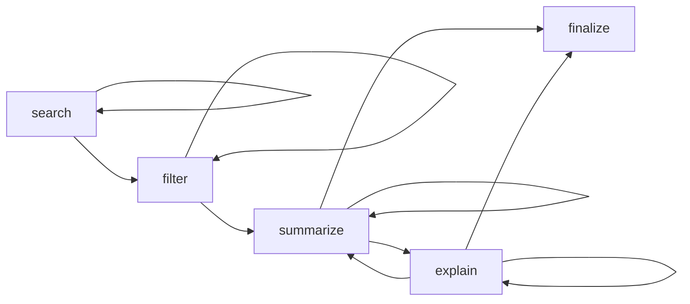

# Walkthrough: Research Paper Assistant RL Environment

## Summary

Transformed the starter echo-based OpenEnv project into a production-grade multi-phase RL environment for academic research assistance. The agent learns to **search → filter → summarize → explain** research papers with dense rewards and deterministic grading.

## Architecture



### Components Created/Modified

| File | Status | Purpose |
|------|--------|---------|
| `data/__init__.py` | NEW | Data layer exports |
| `data/paper_corpus.py` | NEW | 50-paper synthetic corpus with search engine |
| `models.py` | MODIFIED | ResearchAction, ResearchObservation, PaperInfo |
| `tasks/__init__.py` | NEW | Task registry with get_task() |
| `tasks/easy.py` | NEW | single_topic_retrieval (3 GT papers) |
| `tasks/medium.py` | NEW | ambiguous_query_filtering (6 GT, 3 sub-topics) |
| `tasks/hard.py` | NEW | multi_concept_synthesis (10 GT, 4 sub-themes) |
| `graders/__init__.py` | NEW | Grader exports |
| `graders/grader.py` | NEW | 4-metric deterministic scorer |
| `server/research_env.py` | NEW | Core FSM environment |
| `server/app.py` | MODIFIED | Updated to use ResearchAssistantEnvironment |
| `server/__init__.py` | MODIFIED | Updated exports |
| `__init__.py` | MODIFIED | Updated package exports |
| `client.py` | MODIFIED | ResearchAssistantEnv client |
| `inference.py` | MODIFIED | Multi-phase LLM agent with structured prompting |
| `openenv.yaml` | MODIFIED | Full spec with 3 tasks + schemas |
| `pyproject.toml` | MODIFIED | New deps (pydantic) + package mapping |
| `Dockerfile` | MODIFIED | RESEARCH_TASK env var support |
| `README.md` | MODIFIED | Full documentation |

### Deleted
| File | Reason |
|------|--------|
| `server/first_rl_env_environment.py` | Replaced by `research_env.py` |

## Test Results

### Easy Task (`single_topic_retrieval`)
```
RESET   → query loaded, phase=search
SEARCH  → 12 papers retrieved, reward=0.100
FILTER  → 3 papers kept, reward=0.050
SUMMARY → paper_001 summarized, reward=0.200
EXPLAIN → paper_001 explained, reward=0.180
FINALIZE→ Final score: 0.784 ✓
```

### Medium Task (`ambiguous_query_filtering`)
```
SEARCH  → 10 papers retrieved, reward=0.100
FILTER  → 5 papers kept, reward=0.120
SUMMARY → 1 paper summarized, reward=0.033
FINALIZE→ Final score: 0.308 ✓ (lower due to fewer summaries/explanations)
```

### Hard Task (`multi_concept_synthesis`)
```
SEARCH  → 15 papers retrieved, reward=0.075
FINALIZE→ Score: -0.100 ✓ (correct penalty for premature finalize)
```

### Penalty System Verified
| Scenario | Reward | Status |
|----------|--------|--------|
| Invalid action for phase | -0.100 | ✓ |
| Hallucinated paper ID | -0.075 (1 hallucianted) | ✓ |
| Non-existent paper ID | -0.150 | ✓ |
| Empty content | -0.100 | ✓ |
| Repeated identical action | halved | ✓ |

### FastAPI Server
- All routes verified: `/reset`, `/step`, `/state`, `/health`, `/schema`, `/ws`, `/mcp`

## Remaining Steps

1. **Inference test** — Requires `HF_TOKEN` environment variable to test the LLM agent end-to-end
2. **Docker build** — Run `docker build -t research-assistant-env .` to verify containerization
3. **Deployment** — `openenv push` to Hugging Face Spaces
